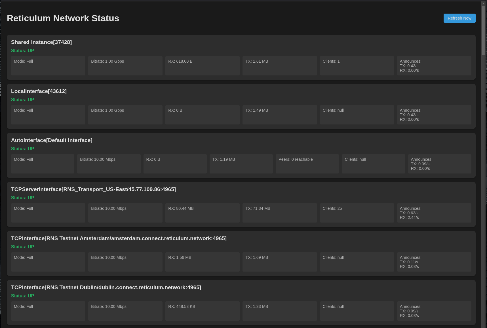

# Reticulum Network Monitor



A lightweight web-based monitoring tool for Reticulum Network Stack (RNS) nodes. This tool provides real-time visibility into your RNS node's status, interfaces, and performance metrics. This is A work in progress and contributions are welcome.

## Important Note About This Project

This monitoring tool is a web interface built on top of the Reticulum Network Stack's status reporting functionality. It uses the same underlying status reporting mechanism as the official `rnstatus` utility but presents the information in a web-based format.

### Attribution and Development Process
- This project uses the core status reporting functionality from the Reticulum Network Stack
- The web interface and monitoring system were developed with assistance from AI tools
- The original `rnstatus` utility, created by Mark Qvist, served as a reference for understanding the RNS status reporting structure

### Relationship to Core RNS
This is an independent monitoring tool that:
- Relies on the existing RNS status reporting functionality
- Does not modify any core RNS functionality
- Runs alongside existing RNS installations
- Is not affiliated with or endorsed by the official RNS project

### Development Transparency
While AI tools were used to accelerate the development process, particularly for:
- Web interface design
- Server implementation
- Configuration setup

The core functionality relies entirely on the official RNS status reporting mechanisms.

This tool is provided as a community contribution to help visualize RNS node status and is not intended to replace or modify any core RNS functionality.

## Features

- Real-time interface status monitoring
- Traffic statistics (TX/RX)
- Peer counts and announce frequencies
- Interface mode and bitrate information
- Web-based interface accessible from any browser
- Automatic updates every 60 seconds
- Uses existing RNS instance (no separate configuration needed)

## Prerequisites

- Python 3.7+
- Running RNS node (rnsd service)
- Python packages:
  - aiohttp

## Installation

1. Install required packages:
```bash
pip3 install aiohttp
```

2. Clone the repository:
```bash
git clone https://github.com/cwilliams001/RNS-Monitor.git
cd rns-monitor
```

3. Create the systemd service file:
```bash
sudo nano /etc/systemd/system/rns-monitor.service
```

Add the following content (adjust paths as needed):
```ini
[Unit]
Description=Reticulum Network Monitor
After=network.target rnsd.service

[Service]
Type=simple
User=your_user
WorkingDirectory=/path/to/monitor
ExecStart=/usr/bin/python3 monitor.py
Restart=always
RestartSec=10

[Install]
WantedBy=multi-target.target
```

4. Start and enable the service:
```bash
sudo systemctl enable rns-monitor
sudo systemctl start rns-monitor
```

## Secure Access Setup (Optional)

To access the monitor securely over HTTPS, you can set up Caddy as a reverse proxy:

1. Install Caddy:
```bash
# On Ubuntu/Debian
sudo apt install caddy
```

2. Configure Caddy:
```bash
sudo nano /etc/caddy/Caddyfile
```

Add:
```
your-domain.com {
    reverse_proxy localhost:8080
    encode gzip
    header {
        # Security headers
        Strict-Transport-Security "max-age=31536000; includeSubDomains"
        X-Content-Type-Options "nosniff"
        X-Frame-Options "DENY"
        Referrer-Policy "strict-origin-when-cross-origin"
    }
}


```

3. Restart Caddy:
```bash
sudo systemctl restart caddy
```

## Firewall Configuration

If using UFW, configure it with:
```bash
sudo ufw allow 80/tcp
sudo ufw allow 443/tcp
```

## Usage

Access the monitor through:
- Local: `http://localhost:8080`
- Remote (with Caddy): `https://your-domain.com`

## Security Considerations

- The monitor uses the shared RNS instance and doesn't require additional RNS configuration
- Consider using Caddy for HTTPS encryption
- Monitor runs on localhost by default

## Contributing

Contributions are welcome! Please feel free to submit a Pull Request.

## License

MIT License

## Acknowledgments

- Built on top of the Reticulum Network Stack
- Thanks to the RNS community for feedback and testing

